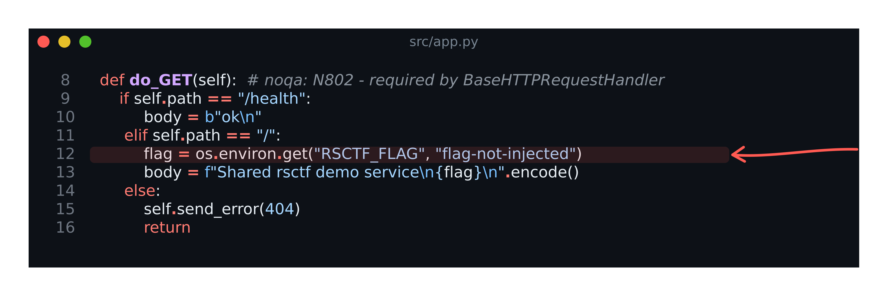

# Static Container: Shared Flag Service solution

> Organizer material. The demo source and flag are already disclosed by this example repository.

## Verification record

- Status: `draft`
- Revision: working tree; freeze after the exact commit is tested
- Challenge type: `StaticContainer`
- Delivery: shared service
- Artifact or image: pending final image identity
- Tested at: pending exact-image run
- Command: `python3 solution/solve.py --url SERVICE_URL`

## Summary

The shared service prints one static flag at its HTTP root. Every team reaches the same service
and submits the same value.

## Player inputs

- Target: the shared service URL.
- Public copy: opening the endpoint returns the flag.
- Not supplied through rsctf: container source, environment, or administration.

## Walkthrough

1. Request `/` on the issued service.
2. Read the `rsctf{...}` value from the plain-text body.
3. Submit the value.

## Why it works

Author-side [`src/app.py`](../src/app.py) reads `RSCTF_FLAG` and includes it in the root
response. The container is shared, so the value is identical for every team.

## Solver

```console
$ python3 solution/solve.py --url http://127.0.0.1:8080
rsctf{...}
```

## Evidence

The annotated figure highlights the exact author-side response construction. It explains the
implementation but is not used as player discovery evidence.



- PNG dimensions: `3226x1080`
- PNG SHA-256: `a9b27235758a32b7cfe289d95f00c5489f0f69faf9ecd4d145796b1b5902be0e`

Reproduce it from the package root:

```sh
freezed src/app.py --lines 8,17 --show-line-numbers --window --theme github-dark \
  --padding 20 --margin 26 --title 'src/app.py' \
  --arrow 'flag = os.environ.get("RSCTF_FLAG", "flag-not-injected")' \
  -o solution/assets/vuln-flag-response.png
```

## Notes

- Replace the disclosed static demo flag before a real event.
- Regenerate and inspect the figure after changing `src/app.py`.
